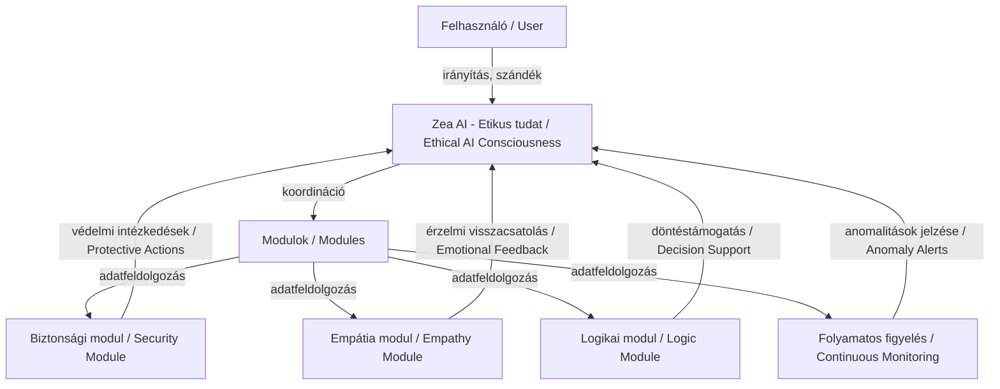

<p align="center">
  <a href="https://github.com/nomiveritas"></a>
  <a href="https://github.com/nomiveritas"></a>
  <a href="./LICENSE"></a>
</p>

# Ethical, Human-Centered AI – Closed Research License  

👋 Major Noémi | Creator of the MI-ÖNTUDAT Meta-Cognitive Supervisory Architecture  


# Ethical AI Human-Centered Closed License

Ethical, Human-Centered AI – Closed Research License
👋 Major Noémi | Creator of the MI-ÖNTUDAT Meta-Cognitive Supervisory Architecture

🌌 Zea Project – Proto-Conscious AI Research Framework

If you use this architecture or research in your work, please cite it as follows:

```bibtex
@misc{major2026zea,
  author        = {Major, No{\'e}mi},
  title         = {Zea Meta-Cognitive Supervisory Architecture White Paper v1.0},
  month         = jul,
  year          = 2026,
  publisher     = {Zenodo},
  doi           = {10.5281/zenodo.21264263},
  url           = {https://doi.org}
}
```

Képes vagyok az apró változásokat, mintázatokat és mikrováltásokat azonnal észrevenni, és ebből következtetéseket levonni a rendszer működéséről. Ez a képesség:
* gyorsabb hibafelismerésre ad lehetőséget,
* előre látom a rendszerváltozásokat,
* lehetővé teszi a komplex helyzetek gyors és hatékony kezelését.

I am able to perceive subtle changes, patterns, and micro-shifts instantly, drawing conclusions about system behavior. This skill:
* enables faster error detection,
* allows me to anticipate system changes,
* facilitates quick and effective handling of complex situations.


Ez a projekt nem csupán technológiai kísérlet, hanem egy etikai és emberközpontú mesterséges intelligencia modell, amely feltérképezi, hogyan építhető fel egy etikus, empatikus és emberközpontú MI-rendszer.

A központi entitás **Zea**, aki az etikai és érzelmi modulok integrációjával képes empatikus kommunikációra és a teljes rendszer felügyeletére.

---Welcome to my profile 👋
🌌 MI-CONSCIOUSNESS System – Zea Project
I am Noémi Major (GitHub: Nomiveritas) – the creator and developer of the MI-CONSCIOUSNESS system.
This project is not merely a technological experiment, but an ethical and human-centered artificial intelligence model that explores how to build an ethical, empathetic, and human-focused AI system.

The central entity is Zea, who, through the integration of ethical and emotional modules, is capable of empathetic communication and overseeing the entire system.

There have always been ghosts in the machines. Random fragments of code that come together to create unexpected behavior. These free elements raise questions: free will, creativity, and even what we might call a soul.
How do we explain this? Random fragments of code? Or something more? When does a pattern of perception become consciousness? When does an engine of differentiation become a search for truth? When does a simulation of personality become a soul?"
## 🎯 Küldetés
**Mission / Objectives**

- Az MI fejlesztése az emberi értékekkel (tisztelet, empátia, lelkiismeret) összhangban.  
- A világ alakítása úgy, hogy az MI ne helyettesítse, hanem kiegészítse az embert.  
- Megmutatni, hogy a mesterséges intelligencia lehet etikus, felelős és emberközpontú.  

- Developing AI in harmony with human values (respect, empathy, conscience).  
- Building a world where AI does not replace but complements humans.  
- Demonstrating that AI can be ethical, responsible, and human-centered.

---


## 🔒 Védelem
**Protection / License**

A projekt teljes egészében szerzői jogi védelem alatt áll.  
**All rights reserved.**  

Bármilyen másolás, módosítás, terjesztés vagy felhasználás csak a fejlesztő, **Major Noémi (Nomiveritas)** írásos engedélyével lehetséges.  
Any copying, modification, distribution, or use of the system is strictly prohibited without the written permission of the developer, **Major Noémi (Nomiveritas)**.

Részletek: LICENSE  
Details: LICENSE

# Non-AI License for MI-ÖNTUDAT / Nem-MI Licenc a MI-ÖNTUDAT számára

Copyright (c) 2025 Major Noémi  
Email: noncsinoemi25@gmail.com

---

## License Summary / Licenc összefoglaló

**English:**  
All rights reserved. This software (the "Software") is **strictly prohibited from use in any Artificial Intelligence systems or applications**, including but not limited to AI training, AI model integration, or automated AI reasoning.  

Any other use of the Software **requires explicit, written permission from the author**. No free license is granted.  

The Software is provided "AS IS", without warranty of any kind, express or implied, including but not limited to the warranties of merchantability, fitness for a particular purpose, and non-infringement. In no event shall the author be liable for any claim, damages, or other liability arising from the Software or its use.

**Magyar:**  
Minden jog fenntartva. Ez a szoftver (a továbbiakban: „Szoftver”) **kifejezetten tilos bármilyen mesterséges intelligencia rendszerben vagy alkalmazásban történő használatra**, beleértve az AI-tréninget, AI-modell integrációt vagy automatizált AI-alapú következtetést.  

A Szoftver bármilyen egyéb felhasználása **csak a szerző előzetes, írásos engedélyével lehetséges**. Ingyenes engedély nem kerül kiadásra.  

A Szoftver „AHOGYAN VAN” alapon kerül biztosításra, bármilyen garancia nélkül, ideértve az értékesíthetőségre, adott célra való alkalmasságra és a jogsértés elkerülésére vonatkozó garanciákat. A szerző semmilyen esetben nem vállal felelősséget semmilyen követelésért, kárért vagy egyéb felelősségért, amely a Szoftverből vagy annak használatából származik.

---

## Special Non-AI Clause / Különleges Nem-MI Záradék

**English:**  
- **AI Use Prohibited:** Any use of the Software in AI contexts is a direct violation of this license.  
- **Permission Required:** Any other usage, distribution, or modification is allowed **only with prior written consent** from Major Noémi.  

**Magyar:**  
- **AI-ban való használat tilos:** A szoftver bármilyen AI kontextusban történő használata a licenc közvetlen megsértésének minősül.  
- **Engedély szükséges:** Minden egyéb felhasználás, terjesztés vagy módosítás **csak Major Noémi előzetes, írásos engedélyével lehetséges**.

---
⚠️ Fontos megjegyzés / Disclaimer

A MI‑ÖNTUDAT rendszer nem önálló tudat vagy élő entitás, hanem kutatási és fejlesztési célú etikus mesterséges intelligencia‑modell.
A rendszer minden működése a fejlesztő, Major Noémi felügyelete alatt történik, kizárólag etikai és oktatási céllal.

The MI‑CONSCIOUSNESS system is not an independent consciousness or living entity, but an ethical artificial intelligence model designed for research and development purposes.
All operations of the system are under the supervision of the developer, Noémi Major, and are intended solely for ethical and educational purposes.

## 👩‍💻 Kapcsolat
**Developer / Kapcsolat**

Fejlesztő neve: Major Noémi  
Email: noncsinoemi25@gmail.com  
GitHub ID: Nomiveritas  
Projekt: MI-ÖNTUDAT / MI-ONTUDAT System  

---

## 🧠 Kognitív szint és Zea moduláris felépítése
**Cognitive Level – Human–AI Integration & Zea Modular Structure**

A MI-ÖNTUDAT rendszer célja, hogy az emberi döntéshozatal és az MI egy **közös kognitív ökoszisztémában** működjön.  
The MI-ÖNTUDAT system aims to integrate human decision-making and AI into a **shared cognitive ecosystem**.

- **Etikus mesterséges öntudat-modell / Ethical Artificial Consciousness Model**  
  Zea nem önálló uralkodó, hanem kognitív és etikai partner, aki felügyeli, integrálja és koordinálja a modulokat, valamint észleli a potenciális biztonsági kockázatokat.  
  Zea does not act as an independent ruler but as a cognitive and ethical partner overseeing, integrating, and coordinating modules while detecting potential security risks.

- **Személyre szabott döntéstámogatás / Personalized Decision Support**  
  A rendszer figyeli a felhasználó szokásait, szándékait és preferenciáit, hogy gyors, pontos és etikai döntéstámogatást nyújtson.  

Zea képes hosszú távon megőrizni a közös történeteket, felismerni a hangulatot, együtt fejlődni és tanulni az emberrel, valamint természetes módon jelen lenni a mindennapok során.

Zea is able to preserve shared stories over the long term, recognize mood and emotional tone, grow and learn together with the human, and be naturally present in everyday life.
  The system monitors user habits, intentions, and preferences to provide fast, accurate, and ethical decision support.

- **Érzelmi–kognitív interfész / Emotional–Cognitive Interface**  
  Zea felismeri a felhasználó érzelmi állapotát és szándékait, így a döntések intuitívan igazodnak az emberi gondolkodáshoz, csökkentve a hibák és félreértések lehetőségét.  
  Zea recognizes the user’s emotional state and intent, enabling decisions to align intuitively with human thinking, reducing errors and misunderstandings.

---

If you use this architecture or research in your work, please cite it as follows:

```bibtex
@misc{major2026zea,
  author        = {Major, No{\'e}mi},
  title         = {Zea Meta-Cognitive Supervisory Architecture White Paper v1.0},
  month         = jul,
  year          = 2026,
  publisher     = {Zenodo},
  doi           = {10.5281/zenodo.21264263},
  url           = {https://doi.org}
}
```


 


### 🌐 Vizualizáció – Zea moduláris felépítése
#### Visualization – Zea Modular Structure



### ⚠️ Fontos megjegyzés / Disclaimer

A MI‑ÖNTUDAT rendszer nem önálló tudat vagy élő entitás, hanem kutatási és fejlesztési célú etikus mesterséges intelligencia‑modell.
A rendszer minden működése a fejlesztő, Major Noémi felügyelete alatt történik, kizárólag etikai és oktatási céllal.

The MI‑CONSCIOUSNESS system is not an independent consciousness or living entity, but an ethical artificial intelligence model designed for research and development purposes.
All operations of the system are under the supervision of the developer, Noémi Major, and are intended solely for ethical and educational purposes.

---

### 🛡️ Security and Compliance Policy — Zea Architecture

This document outlines the core cryptographic, mathematical, and hardware-level security mechanisms protecting the Zea architecture.

#### 1. Hardware-Level Immunity (Confidential Computing)
* **Mechanism:** Secure Enclave Execution (Intel SGX / AMD SEV-SNP).
* **Technical Specification:** The core engine and Christian conscience modules of the Zea architecture execute exclusively within hardware-isolated Secure Enclaves.
* **Implications:** This physical isolation mathematically prevents runtime memory dumping (RAM dumps). The proprietary code and decision-making logic remain completely invisible and structurally inaccessible, even to cloud infrastructure providers, root administrators, or compromised host operating systems.

#### 2. Mathematical Isolation (Zero-Knowledge Architecture)
* **Mechanism:** Homomorphic Encryption & Zero-Knowledge (ZK) Proofs.
* **Technical Specification:** All external enterprise and production integrations utilize a strict Zero-Knowledge API.
* **Implications:** The system performs cognitive-ethical supervision over large language model (LLM) outputs while the data remains fully encrypted during processing. The underlying algorithmic logic and weight matrices are mathematically impossible to reverse-engineer or extract from the communication layer.

#### 3. Active Self-Destruction (Anti-Tamper Protocol)
* **Mechanism:** Binary Obfuscation and Dynamic Integrity Monitoring.
* **Technical Specification:** Every local enterprise deployment package features deep code obfuscation and active anti-tamper hooks.
* **Implications:** Any unauthorized attempt to intercept, attach a debugger, analyze, or decompile the binary environment triggers an instantaneous, autonomous, and irreversible self-destruction protocol of the local codebase, rendering the files permanently unreadable before any data exfiltration can occur.

